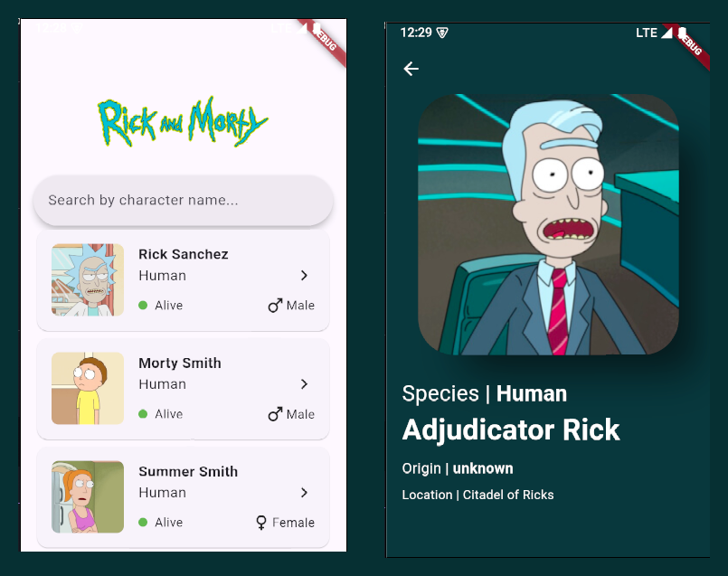
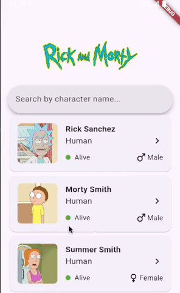

# Rick And Morty App

An app designed for fans of Rick and Morty to explore detailed information about their favorite characters. Browse the complete character list with an intuitive interface, and tap on any character to access more in-depth details, such as their origin, status, and appearances. Save your favorite characters to revisit them anytime and stay immersed in the multiverse!

## We used Flutter to build this App

- Flutter 3.24
- Dart 3.5
- Flutter BloC(flutter_bloc) 9.0.0

## Screenshots
Home Page and Detail Page




## Instructions

#### Run Locally

Clone the project

```bash
  git clone https://github.com/paolojoaquinp/rick_and_morty_app
```

Go to the project directory

```bash
  cd rick_and_morty_app
```

Install dependencies

```bash
  flutter pub get
```

Start the App

```bash
  flutter run -d <id-of-your-device-or-simulator>
```


## Features

- Home Screen
- hero Animation on select Character
- Search Input 
- Get te detail of character


## Video Demo




## Running Tests

To run the unit tests, run the following command

```bash
  flutter test
```

## 🚀 About Me

Experienced Software Engineer with a strong focus on Flutter, bringing over 4 years of expertise to the
table. Distinguished as Flutter La Paz Lead, with notable contributions, including Staffing at Multiple
events in GDG La Paz and Fluter La Paz. Acknowledged speaker at various events in Ecuador, Uruguay
and Bolivia, such as Flutter Ecuador, Flutter Uruguay, DevFest and Google IO. Successfully lead the
development of FireGuard LP, a robust platform of forest fire prevention in Flutter. Proactive and solution-oriented,
showcasing exceptional communication skills and leadership in managing small team projects.

## License

[MIT](https://choosealicense.com/licenses/mit/)


## Support

For support, email me paolojoaquinpintoperez@gmail.com

